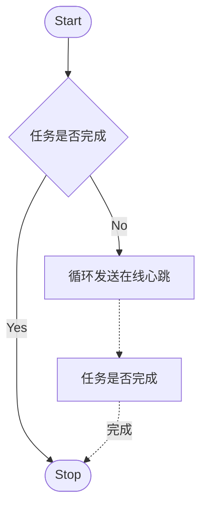

# AWA-Helper

外星人论坛自动做任务。

[简体中文](/README.md) •
[English](/README_en.md)

> **请到[这里](https://gitlocalize.com/repo/8263)帮助我们改进翻译**.

## 使用说明

### 用前说明

1. 使用前请确保AWA帐号已关联Steam帐号且Steam帐号信息已设置为公开
2. 使用前请确保AWA帐号已关联Twitch帐号且Twitch帐号已给AWA扩展授权
3. \[不建议\]如需多开，请将本程序复制到不同文件夹运行

### 通过源码运行

> 此方法会自动安装最新测试版本！

#### 安装运行

1. 前提条件: 安装[Git](https://git-scm.com/downloads)和[NodeJs](https://nodejs.org/zh-cn/download/) >= v16.0.0
2. 克隆此项目`git clone https://github.com/HCLonely/AWA-Helper.git`
3. 安装依赖`npm install`
4. 编译文件`npm run build`
5. 编辑配置文件,[查看说明](#config文件配置)
6. 运行`npm start`/双击`AWA-Helper.bat`

> **说明: 1-5步仅第一次安装时需要，之后每次运行只需要进行第6步即可！**

#### 通过Git更新

1. 拉取更新`git pull`
2. 安装依赖`npm install`
3. 编译文件`npm run build`
4. 运行`npm start`/双击`AWA-Helper.bat`

> **说明: 1-3步仅每次更新后第一次运行需要，之后每次运行只需要进行第4步即可！**

### 下载打包好的程序运行

#### 自动安装依赖

> **此方法需Powershell支持!**

1. [点此](https://github.com/HCLonely/AWA-Helper/releases/latest)下载打包好的压缩包
2. 解压
3. 编辑配置文件,[查看说明](#config文件配置)
4. 首次运行:
    - Windows: 双击`运行-auto.bat`/`Run-auto.bat`运行(缺少依赖会自动安装)
    - Linux: `sudo ./run_auto_linux.sh`
5. 非首次运行:
    - Windows: 双击`运行.bat`/`Run.bat`运行.
    - Linux: `node index.js`

#### 自行安装依赖\[建议\]

1. 安装[NodeJs](https://nodejs.org/zh-cn/download/) >= v16.0.0
2. [点此](https://github.com/HCLonely/AWA-Helper/releases/latest)下载打包好的压缩包
3. 解压
4. 安装依赖`npm install --save`
5. 编辑配置文件,[查看说明](#config文件配置)
6. Windows: 双击`运行.bat`/`Run.bat`运行. Linux: `node index.js`

#### 更新

1. [点此](https://github.com/HCLonely/AWA-Helper/releases/latest)下载最新版的压缩包
2. 解压并覆盖
3. 安装依赖`npm install --save`
4. Windows: 双击`运行.bat`/`Run.bat`运行. Linux: `node index.js`

### 使用Docker

#### 安装

- 体积小，不支持自动登录

```shell
docker pull hclonely/awa-helper
```

- 或支持自动登录：

```shell
docker pull hclonely/awa-helper-chromium
```

#### 运行

```shell
docker run -d --name awa-helper -p 3456:3456 -v /data/awa-helper/config:/usr/src/app/dist/config -v /data/awa-helper/logs:/usr/src/app/dist/logs hclonely/awa-helper
```

> ps:容器内有两个挂载点：`/usr/src/app/dist/config`和`/usr/src/app/dist/logs`，分别对应于本地路径`/data/awa-helper/config`和`/data/awa-helper/logs`（可自定义修改），前者存放配置文件，后者是存放日志文件。

## config文件配置

> **需要复制一份`config.example.yml`文件并重命名为`config.yml`!!!**
>
> 或直接用[参数生成器](https://configer.hclonely.com/?fileLink=https%3A%2F%2Fraw.githubusercontent.com%2FHCLonely%2FAWA-Helper%2Fmain%2Fconfiger%2Fconfiger.template.yml.js)生成配置文件

### 全局配置(必需)

#### 全局配置参数说明

```yml
language: zh # 程序显示语言，目前支持中文 (zh) 和 English (en)
webUI:
  enable: true # 是否启用WebUI
  port: 3456 # WebUI端口
timeout: 0 # 超时设置，单位：秒，0为不限制。如果程序运行超过此时间后还在运行，则终止此程序。
```

### AWA 配置(必需)

#### AWA 参数说明

```yml
awaCookie: '' # 外星人论坛Cookie, 可以只有`REMEMBERME`, 没有`REMEMBERME`则必须有`PHPSESSID`和`sc`, 但会导致连续签到天数获取错误，不会影响其他功能
awaHost: 'www.alienwarearena.com' # 外星人论坛Host, 常用的有`www.alienwarearena.com`和`na.alienwarearena.com`, 默认的没问题就不要改
awaBoosterNotice: true # 外星人论坛任务大于1个时询问是否开启助推器，助推器需要自行开启！！！
awaQuests:
  - dailyQuest # 自动做每日任务，不需要做此任务删除或注释掉此行
  - timeOnSite # 自动做AWA在线任务，不需要做此任务删除或注释掉此行
  - watchTwitch # 自动做Twitch直播间在线任务，不需要做此任务删除或注释掉此行
  - steamQuest # 自动做Steam游戏时长任务，不需要做此任务删除或注释掉此行
awaDailyQuestType: # 每日任务类型，不需要注释掉即可，全部注释=全部开启，如果不需要做每日任务请注释上面的`dailyQuest`
  - click # 浏览页面任务，务标题为任务链接，需点击任务才能完成
  - visitLink # 浏览页面任务，任务标题为任务链接，浏览页面才能完成
  - openLink # 浏览页面任务，任务标题无链接，尝试浏览 排行榜，奖励，商店页面
  - changeBorder # 更换Border
  - changeBadge # 更换Badge
  - changeAvatar # 更换Avatar
  - viewNews # 浏览新闻
  - sharePost # 分享帖子
  - replyPost # 回复帖子
awaDailyQuestNumber1: true # 每日任务有多个时是否只做第一个
awaSafeReply: false # 今日回复过帖子则跳过回复帖子操作，默认不跳过(false)
boosterRule: # 使用ARP Booster的规则，全都注释掉为不启用
  - 2x24h>0 # 此规则代表当2x 24hr ARP Booster数量大于0时使用2x 24hr ARP Booster
  - 2x48h>5 # 此规则代表当2x 48hr ARP Booster数量大于5时使用2x 48hr ARP Booster，上面的规则都不匹配时此规则才生效
boosterCorn: '* * 8 * * 7' # 使用ARP Booster的时间（本地时间）
#             ┬ ┬ ┬ ┬ ┬ ┬
#             │ │ │ │ │ |
#             │ │ │ │ │ └─────────────── 一周的第几天 (0 - 7, 1L - 7L) (0或7是周日) ┐
#             │ │ │ │ └───────────────── 月份　　　　 (1 - 12)　 　　　             ├─ 日期
#             │ │ │ └─────────────────── 每月的第几天 (1 - 31, L)　　　　           ┘
#             │ │ └───────────────────── 小时 (0 - 23) ┐
#             │ └─────────────────────── 分钟 (0 - 59) ├─ 时间
#             └───────────────────────── 秒　 (0 - 59) ┘
# 时间规则说明：当前日期和boosterCorn匹配的日期为同一天且当前时间大于boosterCorn匹配的时间时启用
# 示例中的表达式代表每周六的8点后运行次程序时使用boosterRule规则进行匹配
autoLogin: # 自动登录更新Cookies配置
  enable: true # 是否启用
  username: '' # AWA用户名
  password: '' # AWA密码
autoUpdateDailyQuestDb: false # 自动更新每日任务数据库
```

#### AWA 参数获取方式

##### 自动更新

1. 启用并配置`autoLogin`；
2. `awaCookie`填写`AWACOOKIEAUTOUPDATE`.

##### 手动获取

1. 打开[https://www.alienwarearena.com/account/personalization](https://www.alienwarearena.com/account/personalization)页面，打开控制台，找到网络一栏，筛选`personalization`, 复制请求头中`cookie:`后面的部分，粘贴到配置文件中的`awaCookie`部分；
    
2. [可选&建议] 打开控制台输入以下内容，并把`你的COOKIE`替换为复制的`cookie`，回车运行后会剔除不需要的`cookie`.

    ```javascript
    console.log(`你的COOKIE`.split(';').map((e) => ['REMEMBERME','PHPSESSID','sc'].includes(e.trim().split('=')[0]) ? e.trim() : null).filter((e) => e).join(';'));
    ```

### Twitch 配置(可选)

> 做Twitch在线任务需要，不想做这个任务可以不填。自动做Twitch任务前需要先在Twitch给外星人扩展授权，只需授权一次即可。

#### Twitch 参数说明

```yml
twitchCookie: '' # Twitch Cookie, 须包括`unique_id` 和 `auth-token`
```

#### Twitch 参数获取方式

1. 打开[https://www.twitch.tv/](https://www.twitch.tv/)页面，打开控制台输入以下内容获取：

```javascript
document.cookie.split(';').filter((e) => ['unique_id','auth-token'].includes(e.split('=')[0].trim())).join(';');
```

### Steam 任务配置

> 挂Steam游戏时长的方式, 支持[ASF](https://github.com/JustArchiNET/ArchiSteamFarm)和[SU](https://github.com/DoctorMcKay/node-steam-user).

```yml
steamUse: 'ASF' # 'ASF'或'SU','SU'为模拟Steam客户端
```

### ASF 配置(可选)

> 使用[ASF](https://github.com/JustArchiNET/ArchiSteamFarm)挂Steam游戏时长任务需要，不想做这个任务可以不填。需要`steamUse`为`ASF`.

#### ASF 参数说明

```yml
asfProtocol: 'http' # ASF使用的协议，一般都是`http`
asfHost: '127.0.0.1' # ASF使用的Host，本地运行一般是`127.0.0.1`
asfPort: '1242' # ASF使用的端口，默认是`1242`
asfPassword: '' # ASF密码
asfBotname: '' # 要挂游戏的ASF Bot名称
```

### SU 配置(可选)

> 使用[SU](https://github.com/DoctorMcKay/node-steam-user)挂Steam游戏时长任务需要，不想做这个任务可以不填。需要`steamUse`为`SU`.
>
> 如果Steam启用了两步验证，首次使用此方式时注意按控制台提示输入两步验证码。

#### SU 参数说明

```yml
steamAccountName: '' # Steam用户名
steamPassword: '' # Steam密码
```

### proxy 配置(可选)

> 代理设置，一般Twitch任务需要。

#### proxy 参数说明

```yml
proxy:
  enable:
    - github # 在检测更新时使用代理，不使用删掉此行
    - twitch # 在访问Twitch站点时使用代理，不使用删掉此行
    - awa # 在访问外星人论坛站点时使用代理，不使用删掉此行
    - asf # 在访问ASF时使用代理，不使用删掉此行
    - steam # 在访问Steam时使用代理，不使用删掉此行
    - pusher # 在推送时使用代理，不使用删掉此行
  protocol: 'http' # 代理协议，'http'或'socks'
  host: '127.0.0.1' # 代理host
  port: 1080 # 代理端口
  username: '' # 代理用户名，没有可留空
  password: '' # 代理密码，没有可留空
```

### 推送配置(可选)

#### 推送配置参数说明

```yml
pusher:
  enable: false # 是否启用推送，这里以GoCqhttp为例
  platform: GoCqhttp # 推送平台，具体支持情况请查看 https://github.com/HCLonely/all-pusher-api#已支持平台
  key: # 配置参数，以下参数不是固定的，请参考 https://github.com/HCLonely/all-pusher-api#参数
    token: '******'
    baseUrl: 'http://127.0.0.1:5700'
    user_id: '******'
```

## 功能

### 每日任务


### AWA 在线



### Twitch 任务


### Steam 任务


## 运行示例


## TODO

- [x] AWA回帖保护(已通过ARP Log初步实现)

## 鸣谢

- [axios](https://github.com/axios/axios)
- [chalk](https://github.com/chalk/chalk)
- [cheerio](https://github.com/cheeriojs/cheerio)
- [dayjs](https://github.com/iamkun/dayjs)
- [node-tunnel](https://github.com/koichik/node-tunnel)
- [node-socks-proxy-agent](https://github.com/TooTallNate/node-socks-proxy-agent)
- [yaml](https://github.com/eemeli/yaml)
- [pkg](https://github.com/vercel/pkg)
- [node-steam-user](https://github.com/DoctorMcKay/node-steam-user)
- [TypeScript](https://github.com/Microsoft/TypeScript)
- [node-fs-extra](https://github.com/jprichardson/node-fs-extra)
- [eslint](https://github.com/eslint/eslint)
- [yaml-lint](https://github.com/rasshofer/yaml-lint)
- [express](https://github.com/expressjs/express)
- [express-ws](https://github.com/HenningM/express-ws)
- [lodash](https://github.com/lodash/lodash)
- [playwright](https://github.com/microsoft/playwright)
