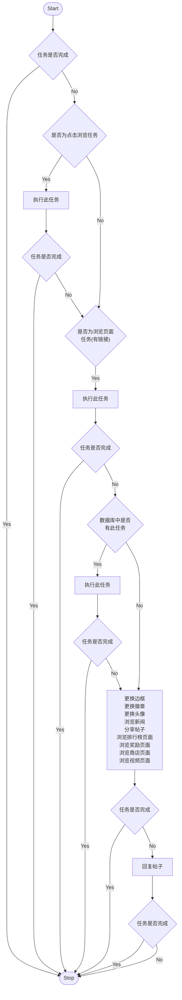
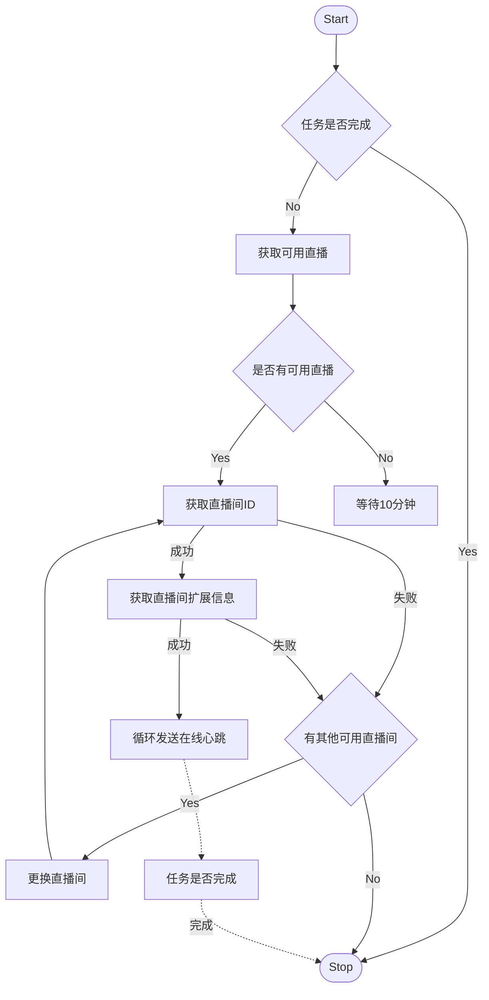
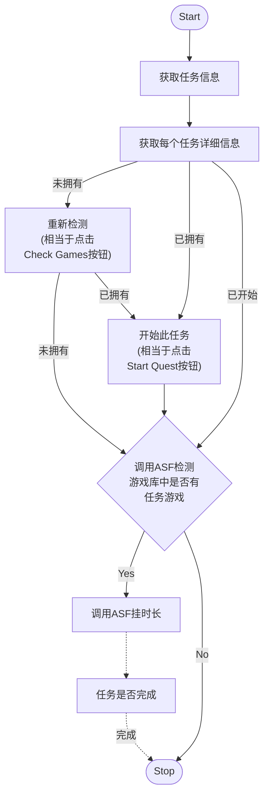

# [AWA-Helper](https://github.com/HCLonely/AWA-Helper)

外星人论坛自动做任务。

[简体中文](/README.md) •
[English](/README_en.md)

> **请到[这里](https://gitlocalize.com/repo/8263)帮助我们改进翻译**.

## 使用说明

### 用前说明

1. 使用前请确保 AWA 帐号已关联 Steam 帐号且 Steam 帐号信息已设置为公开
2. 使用前请确保 AWA 帐号已关联 Twitch 帐号且 Twitch 帐号已给 AWA 扩展授权
3. \[不建议\]如需多开，请将本程序复制到不同文件夹运行

### AWA-Manager

AWA-Manager 是一个 AWA-Helper 的管理器，开启后可在浏览器前端管理 AWA-Helper, 主要功能包括:

- Cookie 同步；
- 配置文件参数设置；
- AWA-Helper 运行状态查看；
- 控制启动/终止 AWA-Helper
- ...

> 建议长期不关机或挂载到服务器的用户使用此 AWA-Manager.

### Cookie 同步

1. 在配置文件中配置[managerServer](#AWA-Manager-配置参数说明)和[webUI](#全局配置参数说明) , 并运行 AWA-Manager；
2. 在浏览器中安装[Tampermonkey BETA](https://www.tampermonkey.net/index.php)扩展（**注意是红色的 BETA 版本，普通版无法获取 Cookie！！！**）；
3. 安装[AWA-Manager](https://github.com/HCLonely/AWA-Helper/raw/main/TM_UserScript/AWA-Manager.user.js)用户脚本；
4. 打开<https://www.alienwarearena.com/control-center>页面配置`ManagerServer`；
5. 每次你打开浏览器页面时都会同步一次 Cookie.

### Windows

#### 安装运行

> 如果你的电脑全天运行不关机或在服务器上运行建议使用 AWA-Manager.
>
> [视频教程](#37)

1. 下载[AWA-Helper-Win.tar.gz](https://github.com/HCLonely/AWA-Helper/releases/latest)并解压；
2. 编辑配置文件,[查看说明](#config-文件配置)
3. 运行(以下两种二选一)：
    - 运行 AWA-Helper: 双击`AWA-Helper.bat`;
    - 运行 AWA-Manager: 双击`AWA-Manager.bat`运行 AWA-Manager;

#### 更新

- 自动更新: 在 config 文件中配置`autoUpdate: true`;
- 手动更新: 双击'update.bat'.

### Linux/Macos

> PS1: MacOS 的兼容性未测试，不建议使用 MacOS 设备运行此程序！
>
> PS2: 既然你使用 Linux 设备，以下为基于有一定 Linux 使用基础的说明！

#### 安装运行

1. (仅首次安装需要)安装[NodeJs](https://nodejs.org/en/download/package-manager) >= v16.0.0;
2. 下载[AWA-Helper-Linux.tar.gz](https://github.com/HCLonely/AWA-Helper/releases/latest)并解压；

    ```bash
    curl -O -L https://github.com/HCLonely/AWA-Helper/releases/download/v2.4.8/AWA-Helper-Linux.tar.gz # 注意替换版本号为最新版
    tar -xzvf AWA-Helper-linux.tar.gz
    sudo mv dist AWA-Helper
    cd AWA-Helper
    ```

3. 编辑配置文件,[查看说明](#config-文件配置)

    ```bash
    sudo cp config.example.yml config.yml
    ```

4. 运行(以下两种二选一)：
    - 运行 AWA-Helper: `node main.js --helper`;
    - 运行 AWA-Manager:
        1. 安装`nodemon`: `sudo npm install -g nodemon`或`sudo npm install -g nodemon --registry=https://registry.npmmirror.com/`(第一种如果安装慢可以使用第二种)
        2. 运行: `nodemon -w main.js -V -L main.js --manager`

#### 更新

- 自动更新: 在 config 文件中配置`autoUpdate: true`;
- 手动更新: 待补充.

### 使用 Docker

#### 运行

> !!! Docker 方式运行不要修改`managerServer`和`webUI`的`port`，并设置`autoUpdate`和`managerServer`的`local`为`false`!!!

- AWA-Manager(建议)

```shell
docker run -d --name awa-helper -p 2345:2345 -p 3456:3456 -v /data/awa-helper/config:/usr/src/app/output/config -v /data/awa-helper/logs:/usr/src/app/output/logs -e helperMode=manager hclonely/awa-helper:latest
```

- 或 AWA-Helper

```shell
docker run -d --name awa-helper -p 3456:3456 -v /data/awa-helper/config:/usr/src/app/output/config -v /data/awa-helper/logs:/usr/src/app/output/logs hclonely/awa-helper:latest
```

> ps:容器内有两个挂载点：`/usr/src/app/dist/config`和`/usr/src/app/dist/logs`，分别对应于本地路径`/data/awa-helper/config`和`/data/awa-helper/logs`（可自定义修改），前者存放配置文件，后者是存放日志文件。

## config 文件配置

> **需要复制一份`config`文件夹里的`config.example.yml`文件并重命名为`config.yml`!!!**

### 全局配置(必需)

#### 全局配置参数说明

```yml
language: zh # 程序显示语言，目前支持中文 (zh) 和 English (en)
webUI:
  enable: true # 是否启用WebUI
  port: 3456 # WebUI端口
  ssl: # WebUI启用SSL
    key: xxx.yyy-key.pem # SSL证书key文件名，将此文件放到与config.yml配置文件同一目录！
    cert: xxx.yyy.pem # SSL证书文件名，将此文件放到与config.yml配置文件同一目录！
timeout: 0 # 超时设置，单位：秒，0为不限制。如果程序运行超过此时间后还在运行，则终止此程序。
logsExpire: 30 # 日志保留时间，单位：天，默认30天，0为不限制。
TLSRejectUnauthorized: true # 是否启用TLSSocket库校验，默认开启。如果使用代理出现网络问题，可尝试更改此项！
UA: 'Mozilla/5.0 (Windows NT 10.0; Win64; x64) AppleWebKit/537.36 (KHTML, like Gecko) Chrome/117.0.0.0 Safari/537.36 Edg/117.0.2045.47' # 浏览器UA
autoUpdate: true # 自动更新
```

### AWA-Manager 配置

#### AWA-Manager 配置参数说明

```yml
managerServer:
  enable: false # 需同时启用webUI
  secret: '' # AWA-Manager Secret，强烈建议修改
  local: true # 仅内网访问，false为开启外网访问
  port: 2345 # AWA managerServer端口
  # ssl: # managerServer启用SSL
    # key: xxx.yyy-key.pem # SSL证书key文件名，将此文件放到与config.yml配置文件同一目录！
    # cert: xxx.yyy.pem # SSL证书文件名，将此文件放到与config.yml配置文件同一目录！
  corn: '3 30 14,21 * * *' # 定时启动AWA-Helper，需开启managerServer
#        ┬ ┬─ ──┬── ┬ ┬ ┬
#        │ │    │   │ │ |
#        │ │    │   │ │ └─────────────── 一周的第几天 (0 - 7, 1L - 7L) (0或7是周日) ┐
#        │ │    │   │ └───────────────── 月份　　　　 (1 - 12)　 　　　             ├─ 日期
#        │ │    │   └─────────────────── 每月的第几天 (1 - 31, L)　　　　           ┘
#        │ │    └───────────────────── 小时 (0 - 23) ┐
#        │ └────────────────────────── 分钟 (0 - 59) ├─ 时间
#        └───────────────────────── ───秒　 (0 - 59) ┘
# 示例中的表达式代表每天的14:30:03和21:30:03启动AWA-Helper
# !! 注意每次运行的时间间隔要大于前面设置的timeout
```

### AWA 配置(必需)

#### AWA 参数说明

```yml
awaCookie: '' # 外星人论坛Cookie, 可以只有`REMEMBERME`, 没有`REMEMBERME`则必须有`PHPSESSID`和`sc`, 但会导致连续签到天数获取错误，不会影响其他功能
awaHost: 'www.alienwarearena.com' # 外星人论坛Host, 常用的有`www.alienwarearena.com`和`na.alienwarearena.com`, 默认的没问题就不要改
# awaBoosterNotice: true # 已弃用！外星人论坛任务大于1个时询问是否开启助推器，助推器需要自行开启！！！
awaQuests:
  - dailyQuest # 自动做每日任务，不需要做此任务删除或注释掉此行
  - timeOnSite # 自动做AWA在线任务，不需要做此任务删除或注释掉此行
  - watchTwitch # 自动做Twitch直播间在线任务，不需要做此任务删除或注释掉此行
  - steamQuest # 自动做Steam游戏时长任务，不需要做此任务删除或注释掉此行
awaDailyQuestType: # 每日任务类型，不需要注释掉即可，全部注释=全部开启，如果不需要做每日任务请注释上面的`dailyQuest`
  - click # 浏览页面任务，务标题为任务链接，需点击任务才能完成
  - visitLink # 浏览页面任务，任务标题为任务链接，浏览页面才能完成
  - openLink # 浏览页面任务，任务标题无链接，尝试浏览 排行榜，奖励，商店页面
  - changeBorder # 更换Border
  - changeBadge # 更换Badge
  - changeAvatar # 更换Avatar
  - viewNews # 浏览新闻
  - sharePost # 分享帖子
  - replyPost # 回复帖子
awaDailyQuestNumber1: true # 每日任务有多个时是否只做第一个
awaSafeReply: false # 今日回复过帖子则跳过回复帖子操作，默认不跳过(false)
autoUpdateDailyQuestDb: false # 自动更新每日任务数据库
joinSteamCommunityEvent: true # 自动加入Steam社区活动
```

#### AWA 参数获取方式

##### 自动更新

参考[Cookie 同步](#cookie-同步)。

##### 手动获取

1. 打开[https://www.alienwarearena.com/account/personalization](https://www.alienwarearena.com/account/personalization)页面，打开控制台，找到网络一栏，筛选`personalization`, 复制请求头中`cookie:`后面的部分，粘贴到配置文件中的`awaCookie`部分；
    
2. [可选&建议] 打开控制台输入以下内容，并把`你的COOKIE`替换为复制的`cookie`，回车运行后会剔除不需要的`cookie`.

    ```javascript
    console.log(`你的COOKIE`.split(';').map((e) => ['REMEMBERME','PHPSESSID','sc'].includes(e.trim().split('=')[0]) ? e.trim() : null).filter((e) => e).join(';'));
    ```

### Twitch 配置(可选)

> 做 Twitch 在线任务需要，不想做这个任务可以不填。自动做 Twitch 任务前需要先在 Twitch 给外星人扩展授权，只需授权一次即可。

#### Twitch 参数说明

```yml
twitchCookie: '' # Twitch Cookie, 须包括`unique_id` 和 `auth-token`
```

#### Twitch 参数获取方式

1. 打开[https://www.twitch.tv/](https://www.twitch.tv/)页面，打开控制台输入以下内容获取：

```javascript
document.cookie.split(';').filter((e) => ['unique_id','auth-token'].includes(e.split('=')[0].trim())).join(';');
```

### Steam 任务配置

> 挂 Steam 游戏时长的方式, 支持[ASF](https://github.com/JustArchiNET/ArchiSteamFarm)和[SU](https://github.com/DoctorMcKay/node-steam-user).
>
> 已支持自选 Steam 游戏任务，需在游戏选择页面同步游戏(`Sync Game`)一次。

```yml
steamUse: 'ASF' # 'ASF'或'SU','SU'为模拟Steam客户端
```

### ASF 配置(可选)

> 使用[ASF](https://github.com/JustArchiNET/ArchiSteamFarm)挂 Steam 游戏时长任务需要，不想做这个任务可以不填。需要`steamUse`为`ASF`.

#### ASF 参数说明

```yml
asfProtocol: 'http' # ASF使用的协议，一般都是`http`
asfHost: '127.0.0.1' # ASF使用的Host，本地运行一般是`127.0.0.1`
asfPort: '1242' # ASF使用的端口，默认是`1242`
asfPassword: '' # ASF密码
asfBotname: '' # 要挂游戏的ASF Bot名称
```

### proxy 配置(可选)

> 代理设置，一般 Twitch 任务需要。

#### proxy 参数说明

```yml
proxy:
  enable:
    - github # 在检测更新时使用代理，不使用删掉此行
    - twitch # 在访问Twitch站点时使用代理，不使用删掉此行
    - awa # 在访问外星人论坛站点时使用代理，不使用删掉此行
    - asf # 在访问ASF时使用代理，不使用删掉此行
    - steam # 在访问Steam时使用代理，不使用删掉此行
    - pusher # 在推送时使用代理，不使用删掉此行
  protocol: 'http' # 代理协议，'http'或'socks'
  host: '127.0.0.1' # 代理host
  port: 7890 # 代理端口
  username: '' # 代理用户名，没有可留空
  password: '' # 代理密码，没有可留空
```

### 推送配置(可选)

#### 推送配置参数说明

```yml
pusher:
  enable: false # 是否启用推送，这里以GoCqhttp为例
  platform: GoCqhttp # 推送平台，具体支持情况请查看 https://github.com/HCLonely/all-pusher-api#已支持平台
  key: # 配置参数，以下参数不是固定的，请参考 https://github.com/HCLonely/all-pusher-api#参数
    token: '******'
    baseUrl: 'http://127.0.0.1:5700'
    user_id: '******'
```

## 功能

### 每日任务



### AWA 在线


### Twitch 任务



### Steam 任务



## 运行示例


## 感谢以下开源项目

- [axios](https://github.com/axios/axios)
- [chalk](https://github.com/chalk/chalk)
- [cheerio](https://github.com/cheeriojs/cheerio)
- [cron-parser](https://github.com/harrisiirak/cron-parser)
- [dayjs](https://github.com/iamkun/dayjs)
- [decompress](https://github.com/kevva/decompress)
- [express](https://github.com/expressjs/express)
- [express-ws](https://github.com/HenningM/express-ws)
- [form-data](https://github.com/form-data/form-data)
- [i18n-node](https://github.com/mashpie/i18n-node)
- [lodash](https://github.com/lodash/lodash)
- [node-cron](https://github.com/node-cron/node-cron)
- [node-tunnel](https://github.com/koichik/node-tunnel)
- [node-socks-proxy-agent](https://github.com/TooTallNate/node-socks-proxy-agent)
- [yaml](https://github.com/eemeli/yaml)
- [yaml-lint](https://github.com/rasshofer/yaml-lint)
- [eslint](https://github.com/eslint/eslint)
- [node-fs-extra](https://github.com/jprichardson/node-fs-extra)
- [highlight.js](https://github.com/highlightjs/highlight.js)
- [marked](https://github.com/markedjs/marked)
- [rollup](https://github.com/rollup/rollup)
- [TypeScript](https://github.com/Microsoft/TypeScript)
- [UglifyJS](https://github.com/mishoo/UglifyJS)
