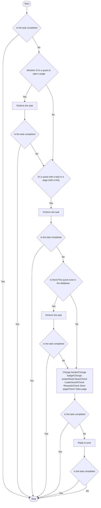
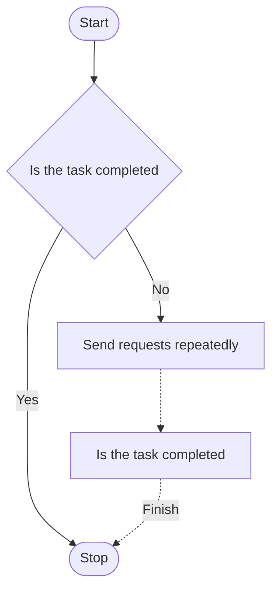
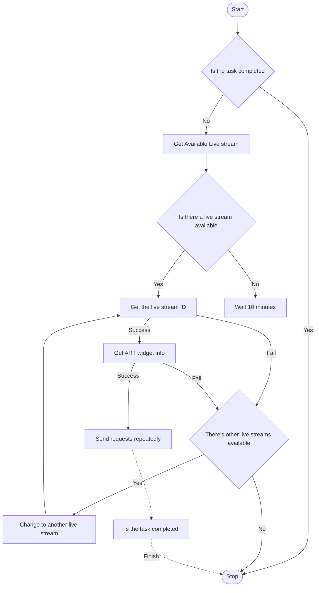
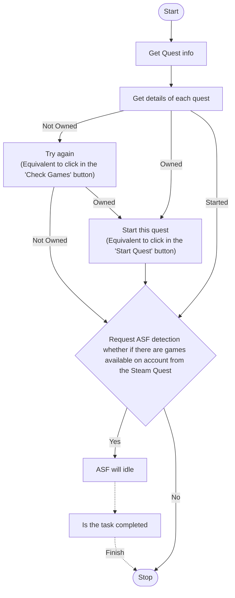

# [AWA-Helper](https://github.com/HCLonely/AWA-Helper)

Automatically does AWA quests.<br>This document comes from machine translation

[简体中文](/README.md) • [English](/README_en.md)

> **Please help us improve the translation [here](https://gitlocalize.com/repo/8263)** .

## Instructions

### Instructions before use

1. Before using it, please make sure that your AWA account has a Steam account linked and that the Steam profile settings have been set to public;
2. Before using it, please make sure that your AWA account has a Twitch account linked and that the Twitch account has been granted access to the AWA ARP widget;
3. [Not recommended] If you want to use more than one account, copy the program to another folder to run multiple accounts.

### AWA-Manager

AWA-Manager is a manager of AWA-Helper. After it is turned on, it can manage AWA-Helper on the browser. Its main functions include:

- Cookie synchronization;
- Configuration file parameter settings;
- View AWA-Helper running status;
- Control starting/terminating AWA-Helper
- ...

> It is recommended that users who do not shut down or mount to the server for a long time use this AWA-Manager.

### Cookie synchronization

1. 在配置文件中配置[managerServer](#AWA-Manager-%E9%85%8D%E7%BD%AE%E5%8F%82%E6%95%B0%E8%AF%B4%E6%98%8E)和[webUI](#%E5%85%A8%E5%B1%80%E9%85%8D%E7%BD%AE%E5%8F%82%E6%95%B0%E8%AF%B4%E6%98%8E) , 并运行 AWA-Manager；
2. 在浏览器中安装[Tampermonkey BETA](https://www.tampermonkey.net/index.php)扩展（**注意是红色的 BETA 版本，普通版无法获取 Cookie！！！**）；
3. 安装[AWA-Manager](https://github.com/HCLonely/AWA-Helper/raw/main/TM_UserScript/AWA-Manager.user.js)用户脚本；
4. 打开[https://www.alienwarearena.com/control-center](https://www.alienwarearena.com/control-center)页面配置`ManagerServer`；
5. 每次你打开浏览器页面时都会同步一次 Cookie.

### Windows

#### Install and run

> 如果你的电脑全天运行不关机或在服务器上运行建议使用 AWA-Manager.

1. 下载[AWA-Helper-Win.tar.gz](https://github.com/HCLonely/AWA-Helper/releases/latest)并解压；
2. 编辑配置文件,[查看说明](#config-%E6%96%87%E4%BB%B6%E9%85%8D%E7%BD%AE)
3. 运行(以下两种二选一)：
    - 运行 AWA-Helper: 双击`AWA-Helper.bat`;
    - 运行 AWA-Manager: 双击`AWA-Manager.bat`运行 AWA-Manager;

#### Update

- 自动更新: 在 config 文件中配置`autoUpdate: true`;
- 手动更新: 双击'update.bat'.

### Linux/Macos

> PS1: MacOS 的兼容性未测试，不建议使用 MacOS 设备运行此程序！
>
> PS2: 既然你使用 Linux 设备，以下为基于有一定 Linux 使用基础的说明！

#### 安装运行

1. (仅首次安装需要)安装[NodeJs](https://nodejs.org/en/download/package-manager) &gt;= v16.0.0;

2. 下载[AWA-Helper-Linux.tar.gz](https://github.com/HCLonely/AWA-Helper/releases/latest)并解压；

    ```bash
    curl -O -L https://github.com/HCLonely/AWA-Helper/releases/download/v2.4.8/AWA-Helper-Linux.tar.gz # 注意替换版本号为最新版
    tar -xzvf AWA-Helper-linux.tar.gz
    sudo mv dist AWA-Helper
    cd AWA-Helper
    ```

3. 编辑配置文件,[查看说明](#config-%E6%96%87%E4%BB%B6%E9%85%8D%E7%BD%AE)

    ```bash
    sudo cp config.example.yml config.yml
    ```

4. 运行(以下两种二选一)：

    - 运行 AWA-Helper: `node main.js --helper`;
    - 运行 AWA-Manager:
        1. 安装`nodemon`: `sudo npm install -g nodemon`或`sudo npm install -g nodemon --registry=https://registry.npmmirror.com/`(第一种如果安装慢可以使用第二种)
        2. 运行: `nodemon -w main.js -V -L main.js --manager`

#### 更新

- 自动更新: 在 config 文件中配置`autoUpdate: true`;
- 手动更新: 待补充.

### Docker

#### Install

```shell
docker pull hclonely/awa-helper
```

#### Run

> !!! Docker 方式运行不要修改`managerServer`和`webUI`的`port`，并设置`autoUpdate`和`managerServer`的`local`为`false`!!!

- AWA-Manager(建议)

```shell
docker run -d --name awa-helper -p 2345:2345 -p 3456:3456 -v /data/awa-helper/config:/usr/src/app/output/config -v /data/awa-helper/logs:/usr/src/app/output/logs -e helperMode=manager hclonely/awa-helper:latest
```

- 或 AWA-Helper

```shell
docker run -d --name awa-helper -p 3456:3456 -v /data/awa-helper/config:/usr/src/app/output/config -v /data/awa-helper/logs:/usr/src/app/output/logs hclonely/awa-helper:latest
```

> ps:容器内有两个挂载点：`/usr/src/app/dist/config`和`/usr/src/app/dist/logs`，分别对应于本地路径`/data/awa-helper/config`和`/data/awa-helper/logs`（可自定义修改），前者存放配置文件，后者是存放日志文件。

## config (File configuration)

> **The `config.example.yml` file needs to be renamed to `config.yml`!!!**

### Global configuration (required)

#### Global configuration parameters description

```yml
language: zh # 程序显示语言，目前支持中文 (zh) 和 English (en)
webUI:
  enable: true # 是否启用WebUI
  port: 3456 # WebUI端口
  ssl: # WebUI启用SSL
    key: xxx.yyy-key.pem # SSL证书key文件名，将此文件放到与config.yml配置文件同一目录！
    cert: xxx.yyy.pem # SSL证书文件名，将此文件放到与config.yml配置文件同一目录！
timeout: 0 # 超时设置，单位：秒，0为不限制。如果程序运行超过此时间后还在运行，则终止此程序。
logsExpire: 30 # 日志保留时间，单位：天，默认30天，0为不限制。
TLSRejectUnauthorized: true # 是否启用TLSSocket库校验，默认开启。如果使用代理出现网络问题，可尝试更改此项！
UA: 'Mozilla/5.0 (Windows NT 10.0; Win64; x64) AppleWebKit/537.36 (KHTML, like Gecko) Chrome/117.0.0.0 Safari/537.36 Edg/117.0.2045.47' # 浏览器UA
autoUpdate: true # 自动更新
```

### AWA-Manager 配置

#### AWA-Manager 配置参数说明

```yml
managerServer:
  enable: false # 需同时启用webUI
  secret: '' # AWA-Manager Secret，强烈建议修改
  local: true # 仅内网访问，false为开启外网访问
  port: 2345 # AWA managerServer端口
  # ssl: # managerServer启用SSL
    # key: xxx.yyy-key.pem # SSL证书key文件名，将此文件放到与config.yml配置文件同一目录！
    # cert: xxx.yyy.pem # SSL证书文件名，将此文件放到与config.yml配置文件同一目录！
  corn: '3 30 14,21 * * *' # 定时启动AWA-Helper，需开启managerServer
#        ┬ ┬─ ──┬── ┬ ┬ ┬
#        │ │    │   │ │ |
#        │ │    │   │ │ └─────────────── 一周的第几天 (0 - 7, 1L - 7L) (0或7是周日) ┐
#        │ │    │   │ └───────────────── 月份　　　　 (1 - 12)　 　　　             ├─ 日期
#        │ │    │   └─────────────────── 每月的第几天 (1 - 31, L)　　　　           ┘
#        │ │    └───────────────────── 小时 (0 - 23) ┐
#        │ └────────────────────────── 分钟 (0 - 59) ├─ 时间
#        └───────────────────────── ───秒　 (0 - 59) ┘
# 示例中的表达式代表每天的14:30:03和21:30:03启动AWA-Helper
# !! 注意每次运行的时间间隔要大于前面设置的timeout
```

### AWA configuration (Required)

#### AWA parameter description

```yml
awaCookie: '' # 外星人论坛Cookie, 可以只有`REMEMBERME`, 没有`REMEMBERME`则必须有`PHPSESSID`和`sc`, 但会导致连续签到天数获取错误，不会影响其他功能
awaHost: 'www.alienwarearena.com' # 外星人论坛Host, 常用的有`www.alienwarearena.com`和`na.alienwarearena.com`, 默认的没问题就不要改
# awaBoosterNotice: true # 已弃用！外星人论坛任务大于1个时询问是否开启助推器，助推器需要自行开启！！！
awaQuests:
  - dailyQuest # 自动做每日任务，不需要做此任务删除或注释掉此行
  - timeOnSite # 自动做AWA在线任务，不需要做此任务删除或注释掉此行
  - watchTwitch # 自动做Twitch直播间在线任务，不需要做此任务删除或注释掉此行
  - steamQuest # 自动做Steam游戏时长任务，不需要做此任务删除或注释掉此行
awaDailyQuestType: # 每日任务类型，不需要注释掉即可，全部注释=全部开启，如果不需要做每日任务请注释上面的`dailyQuest`
  - click # 浏览页面任务，务标题为任务链接，需点击任务才能完成
  - visitLink # 浏览页面任务，任务标题为任务链接，浏览页面才能完成
  - openLink # 浏览页面任务，任务标题无链接，尝试浏览 排行榜，奖励，商店页面
  - changeBorder # 更换Border
  - changeBadge # 更换Badge
  - changeAvatar # 更换Avatar
  - viewNews # 浏览新闻
  - sharePost # 分享帖子
  - replyPost # 回复帖子
awaDailyQuestNumber1: true # 每日任务有多个时是否只做第一个
awaSafeReply: false # 今日回复过帖子则跳过回复帖子操作，默认不跳过(false)
autoUpdateDailyQuestDb: false # 自动更新每日任务数据库
joinSteamCommunityEvent: true # 自动加入Steam社区活动
```

#### AWA parameter configuration methods

##### Automatic update

参考[Cookie 同步](#cookie-%E5%90%8C%E6%AD%A5)。

##### Get it yourself

1. Open the [https://www.alienwarearena.com/account/personalization](https://www.alienwarearena.com/account/personalization) page, open browser console, find the Network tab, filter`personalization`, copy the part after`cookie:`in the Request Header, and paste it into the`awaCookie`part of the configuration file; 

2. [Optional &amp; Recommended] Open browser console and enter the following, and replace `YOURCOOKIE` with the copied `cookie`. After pressing Enter, all the unnecessary parts will be removed.

    ```javascript
    console.log(`YOURCOOKIE`.split(';').map((e) => ['REMEMBERME','PHPSESSID','sc'].includes(e.trim().split('=')[0]) ? e.trim() : null).filter((e) => e).join(';'));
    ```

### Twitch configuration (optional)

> Required to do Twitch quests, if you don't want to do this task, you can leave it blank. Before doing Twitch tasks automatically, you need to grant access to the AWA ARP widget on Twitch first. You only need to do this once.

#### Twitch parameter description

```yml
twitchCookie: '' # Twitch Cookie, it must include `unique_id` and `auth-token`
```

#### How to get Twitch parameters

1. Open [https://www.twitch.tv/](https://www.twitch.tv/) page, open browser console and enter the following to obtain:

```javascript
document.cookie.split(';').filter((e) => ['unique_id','auth-token'].includes(e.split('=')[0].trim())).join(';');
```

### Steam Quest Configuration

> How to idle Steam games, supports [ASF](https://github.com/JustArchiNET/ArchiSteamFarm) and [SU](https://github.com/DoctorMcKay/node-steam-user).
>
> Optional Steam Game quest is supported, and you need to Sync the game (`Sync Game`) once on the game selection page.

```yml
steamUse: 'ASF' # 'ASF' or 'SU', 'SU' simulates Steam client
```

### ASF configuration (optional)

> Using [ASF](https://github.com/JustArchiNET/ArchiSteamFarm) to idle Steam games requires extensive configuration on ASF apart from AWA Helper. If you don’t want to do this part, you can leave it blank. Requires 'steamUse' for 'ASF'.

#### ASF parameters description

```yml
asfProtocol: 'http' # Protocol used by ASF, usually `http`
asfHost: '127.0.0.1' # Host used by ASF, usually `127.0.0.1` for local operation
asfPort: '1242' # Port used by ASF, default is `1242`
asfPassword: '' # ASF password
asfBotname: '' # ASF Bot name to idle game
```

### Proxy configuration (optional)

> proxy parameter description

#### proxy parameter description

```yml
proxy:
  enable:
    - github # 在检测更新时使用代理，不使用删掉此行
    - twitch # 在访问Twitch站点时使用代理，不使用删掉此行
    - awa # 在访问外星人论坛站点时使用代理，不使用删掉此行
    - asf # 在访问ASF时使用代理，不使用删掉此行
    - steam # 在访问Steam时使用代理，不使用删掉此行
    - pusher # 在推送时使用代理，不使用删掉此行
  protocol: 'http' # 代理协议，'http'或'socks'
  host: '127.0.0.1' # 代理host
  port: 7890 # 代理端口
  username: '' # 代理用户名，没有可留空
  password: '' # 代理密码，没有可留空
```

### Push configuration (optional)

#### Description of push configuration parameters

```yml
pusher:
  enable: false # Whether to enable push，Here is an example of GoCqhttp
  platform: GoCqhttp # Push platform, please check the specific support https://github.com/HCLonely/all-pusher-api#已支持平台
  key: # Configuration parameters，The following parameters are not fixed，Please refer to https://github.com/HCLonely/all-pusher-api#参数
    token: '******'
    baseUrl: 'http://127.0.0.1:5700'
    user_id: '******'
```

## Function

### Daily Quests



### AWA Online



### Twitch Quest



### Steam Quest



## Example running


## 感谢以下开源项目

- [axios](https://github.com/axios/axios)
- [chalk](https://github.com/chalk/chalk)
- [cheerio](https://github.com/cheeriojs/cheerio)
- [cron-parser](https://github.com/harrisiirak/cron-parser)
- [dayjs](https://github.com/iamkun/dayjs)
- [decompress](https://github.com/kevva/decompress)
- [express](https://github.com/expressjs/express)
- [express-ws](https://github.com/HenningM/express-ws)
- [form-data](https://github.com/form-data/form-data)
- [i18n-node](https://github.com/mashpie/i18n-node)
- [lodash](https://github.com/lodash/lodash)
- [node-cron](https://github.com/node-cron/node-cron)
- [node-tunnel](https://github.com/koichik/node-tunnel)
- [node-socks-proxy-agent](https://github.com/TooTallNate/node-socks-proxy-agent)
- [yaml](https://github.com/eemeli/yaml)
- [yaml-lint](https://github.com/rasshofer/yaml-lint)
- [eslint](https://github.com/eslint/eslint)
- [node-fs-extra](https://github.com/jprichardson/node-fs-extra)
- [highlight.js](https://github.com/highlightjs/highlight.js)
- [marked](https://github.com/markedjs/marked)
- [rollup](https://github.com/rollup/rollup)
- [TypeScript](https://github.com/Microsoft/TypeScript)
- [UglifyJS](https://github.com/mishoo/UglifyJS)
