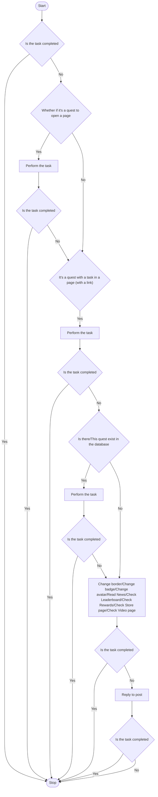
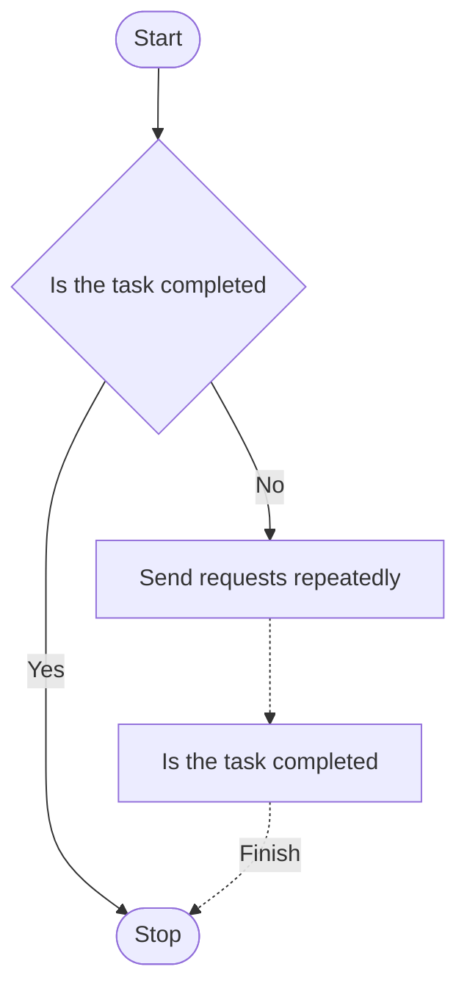
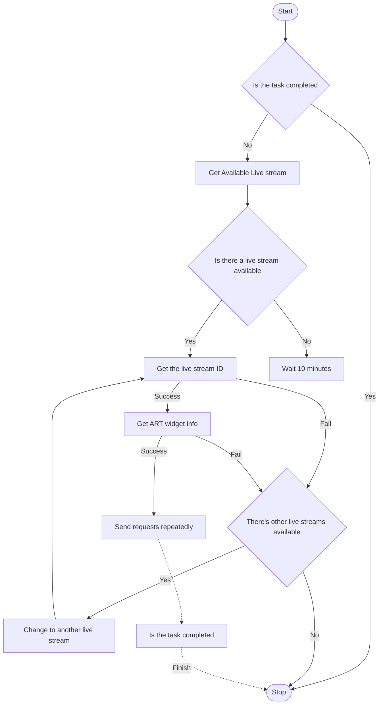
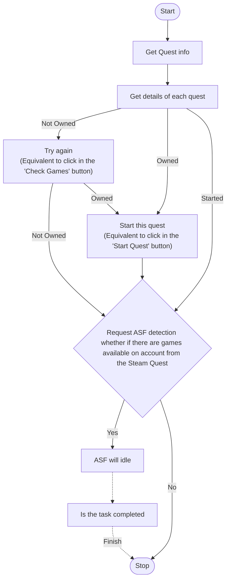

# [AWA-Helper](https://github.com/HCLonely/AWA-Helper)

Automatically does AWA quests.<br>This document comes from machine translation

[简体中文](/README.md) • [English](/README_en.md)

> **Please help us improve the translation [here](https://gitlocalize.com/repo/8263)** .

## Instructions

### Instructions before use

0. **!!!Running this program at the same time as COD may result in a COD account ban. Please close this program when playing COD !!!**
1. Before using it, please make sure that your AWA account has a Steam account linked and that the Steam profile settings have been set to public;
2. Before using, please make sure that your AWA account has been linked to your Twitch account and that your Twitch account has authorized the AWA extension ( [how to link?](https://keylol.com/t782079-1-1) )
3. [Not recommended] If you want to use more than one account, copy the program to another folder to run multiple accounts.

### AWA-Manager

AWA-Manager is a manager of AWA-Helper. After it is turned on, it can manage AWA-Helper on the browser. Its main functions include:

- Cookie synchronization;
- Configuration file parameter settings;
- View DailyQuest running status;
- Control starting/terminating DailyQuest
- ...

> It is recommended that users who do not shut down or mount to the server for a long time use this AWA-Manager.

### Cookie synchronization

1. Configure `manager` and `webUI` in the configuration file, then run Manager;
2. Install [the Tampermonkey BETA](https://www.tampermonkey.net/index.php) extension in the browser ( **note that it is the red BETA version, the regular version cannot obtain cookies!!!** );
3. Install [AWA-Manager](https://github.com/HCLonely/AWA-Helper/raw/main/TM_UserScript/AWA-Manager.user.js) user script;
4. Open the [https://www.alienwarearena.com/control-center](https://www.alienwarearena.com/control-center) page to configure `ManagerServer` ;
5. Cookies are synchronized every time you open a browser page.

### Run through compiled executable file

> If your computer runs all day without shutting down or runs on a server, it is recommended to use AWA-Manager.
>
> [Video tutorial](https://github.com/HCLonely/AWA-Helper/issues/37)

#### Windows

##### Install and run

1. Download [AWA-Helper-Win.tar.gz](https://github.com/HCLonely/AWA-Helper/releases/latest) and unzip it;
2. Edit the configuration file and [view the instructions](#config-%E6%96%87%E4%BB%B6%E9%85%8D%E7%BD%AE)
3. Choose how to run:
    - Run DailyQuest once: double-click `AWA-DailyQuest.bat`;
    - Run AWA-Manager: Double-click `AWA-Manager.bat` to run AWA-Manager;
    - Run AWA-Manager in the system tray: double-click `AWA-Manager.exe`. Hover over the icon for task status, double-click it to open the WebUI, or use its context menu to inspect status, start or stop Helper/Achievement, toggle startup at sign-in for the current user, and exit Manager.

##### Update

- Update checks notify you about new releases; enable `autoUpdate` to verify and install GitHub Releases automatically;
- Manual update: Double-click 'update.bat'.

#### Linux

> PS1: MacOS compatibility has not been tested, and it is not recommended to use MacOS devices to run this program!
>
> PS2: Since you are using Linux equipment, the following are instructions based on a certain basic knowledge of Linux usage!

##### Install and run

1. Download [AWA-Helper-Linux-x64.tar.gz](https://github.com/HCLonely/AWA-Helper/releases/latest) and unzip it;

    ```bash
    curl -O -L https://github.com/HCLonely/AWA-Helper/releases/download/v3.0.2/AWA-Helper-Linux-x64.tar.gz # 注意替换版本号和CPU架构x64, armv7, armv8
    tar -xzvf AWA-Helper-linux-x64.tar.gz
    sudo mv dist AWA-Helper
    cd AWA-Helper
    sudo chmod +x AWA-DailyQuest.sh
    sudo chmod +x AWA-Manager.sh
    sudo chmod +x update.sh
    ```

2. Edit the configuration file and [view the instructions](#config-%E6%96%87%E4%BB%B6%E9%85%8D%E7%BD%AE)

    ```bash
    sudo cp config/config.example.yml config/config.yml
    ```

3. Run (choose one of the following two):

    - Run DailyQuest once: `./AWA-DailyQuest.sh`;
    - Run AWA-Manager: `./AWA-Manager.sh` .

#### Update

- Update checks notify you about new releases; enable `autoUpdate` to verify and install GitHub Releases automatically;
- Manual update: `./update.sh` .

### Run via NodeJS

> The file size downloaded when updating with this method is small, but NodeJS needs to be installed locally.

#### Install and run

1. (Only required for first time installation) Install [NodeJs](https://nodejs.org/en/download/package-manager) &gt;= v16.0.0;

2. Download [index.js](https://github.com/HCLonely/AWA-Helper/releases/latest) ;

    ```bash
    mkdir AWA-Helper
    cd AWA-Helper
    curl -O -L https://github.com/HCLonely/AWA-Helper/releases/download/v3.0.2/index.js # replace with the latest version
    ```

3. (Only required for first time installation) Initialization

    ```bash
    node index.js --init
    ```

4. Edit the configuration file and [view the instructions](#config-%E6%96%87%E4%BB%B6%E9%85%8D%E7%BD%AE)

    ```bash
    cp config/config.example.yml config/config.yml
    ```

5. Run (choose one of the following two):

    - Run DailyQuest once: `node index.js --daily`;
    - Run persistent Manager: `node index.js --manager` or `node index.js`.
    - The deprecated `--helper` flag remains an alias for `--daily`.

#### Update

- Update checks notify you about new releases; enable `autoUpdate` to verify and install GitHub Releases automatically;
- Manual update: `node index.js --update` ;

### Docker

#### Run

> Docker exposes only the unified `webUI.port`, which defaults to 2345. Inside Docker, `webUI.local` is ignored and the server listens on all interfaces so port publishing works.

- AWA-Manager (recommended)

```shell
docker run -d --name awa-helper -p 2345:2345 -v /data/awa-helper/config:/usr/src/app/output/config -v /data/awa-helper/logs:/usr/src/app/output/logs -v /data/awa-helper/data:/usr/src/app/output/data hclonely/awa-helper:latest
```

- or AWA-Helper

```shell
docker run -d --name awa-helper -p 2345:2345 -v /data/awa-helper/config:/usr/src/app/output/config -v /data/awa-helper/logs:/usr/src/app/output/logs hclonely/awa-helper:latest
```

> ps: There are three mount points in the container:
> `/usr/src/app/dist/config`: corresponding to the local paths `/data/awa-helper/config`
> `/usr/src/app/dist/logs`: corresponding to the local paths `/data/awa-helper/logs`
> `/usr/src/app/dist/data`: corresponding to the local paths `/data/awa-helper/data`

## Achievement

> Achievement is scheduled by AWA-Manager and cannot run independently of Manager.

### Usage method

1. Open `AWA-Manager` management background;
2. Click the `Start AWA-Achievement` button.

## config (File configuration)

> **You need to copy the `config.example.yml` file in the `config` folder and rename it to `config.yml` !!!**

### Global configuration (required)

#### Global configuration parameters description

```yml
language: zh # 程序显示语言，目前支持中文 (zh) 和 English (en)
webUI:
  enable: true # 是否启用WebUI
  port: 2345 # WebUI端口
  local: true # 仅内网访问，false为开启外网访问
  ssl: # WebUI启用SSL
    key: xxx.yyy-key.pem # SSL证书key文件名，将此文件放到与config.yml配置文件同一目录！
    cert: xxx.yyy.pem # SSL证书文件名，将此文件放到与config.yml配置文件同一目录！
timeout: 0 # 超时设置，单位：秒，0为不限制。如果程序运行超过此时间后还在运行，则终止此程序。
logsExpire: 30 # 日志保留时间，单位：天，默认30天，0为不限制。
TLSRejectUnauthorized: true # 是否启用TLSSocket库校验，默认开启。如果使用代理出现网络问题，可尝试更改此项！
UA: 'Mozilla/5.0 (Windows NT 10.0; Win64; x64) AppleWebKit/537.36 (KHTML, like Gecko) Chrome/117.0.0.0 Safari/537.36 Edg/117.0.2045.47' # 浏览器UA
autoUpdate: false # Check for and install updates that pass SHA-256 verification
```

### AWA-Manager configuration

#### AWA-Manager configuration parameter description

```yml
manager:
  secret: '' # generated automatically on first startup when empty
  dailyQuest:
    cron: '3 30 14,21 * * *'
  achievement:
    enable: false
    cron: '0 14 * * *'
  artifacts:
    - cron: '7 29 9 * * 1'
      ids: [636, 17056, 30235]
```

### AWA configuration (Required)

#### AWA parameter description

```yml
awaCookie: '' # 外星人论坛Cookie
awaHost: 'www.alienwarearena.com' # 外星人论坛Host, 常用的有`www.alienwarearena.com`和`na.alienwarearena.com`, 默认的没问题就不要改
awaQuests:
  - getStarted # 自动做左下角的GET STARTED任务，不需要做此任务删除或注释掉此行
  - dailyQuest # 自动做每日任务，不需要做此任务删除或注释掉此行
  # - battlePass # Automatically claim available Battle Pass rewards (disabled by default)
  # 每日任务(旧版)类型，不需要注释掉即可，如果不需要做此任务请注释上面的`dailyQuestOld`
  - timeOnSite # 自动做AWA在线任务，不需要做此任务删除或注释掉此行
  - watchTwitch # 自动做Twitch直播间在线任务，不需要做此任务删除或注释掉此行
  - steamQuest # 自动做Steam游戏时长任务，不需要做此任务删除或注释掉此行
awaDailyQuestType: # 每日任务类型，不需要注释掉即可，全部注释=全部开启，如果不需要做每日任务请注释上面的`dailyQuestOld`
  - click # 浏览页面任务，务标题为任务链接，需点击任务才能完成
  - visitLink # 浏览页面任务，任务标题为任务链接，浏览页面才能完成
  - openLink # 浏览页面任务，任务标题无链接，尝试浏览 排行榜，奖励，商店页面
  - changeBorder # 更换Border
  - changeBadge # 更换Badge
  - changeAvatar # 更换Avatar
  - viewNews # 浏览新闻
  - sharePost # 分享帖子
  # - replyPost # 回复帖子
joinSteamCommunityEvent: true # 自动加入Steam社区活动
```

#### AWA parameter configuration methods

##### Automatic update

See [Cookie synchronization](#cookie-%E5%90%8C%E6%AD%A5) .

##### Get it yourself

- Open the [https://www.alienwarearena.com/account/personalization](https://www.alienwarearena.com/account/personalization) page, open browser console, find the Network tab, filter`personalization`, copy the part after`cookie:`in the Request Header, and paste it into the`awaCookie`part of the configuration file; 

### Twitch configuration (optional)

> Required to do Twitch quests, if you don't want to do this task, you can leave it blank. Before doing Twitch tasks automatically, you need to grant access to the AWA ARP widget on Twitch first. You only need to do this once.

#### Twitch parameter description

```yml
twitchCookie: '' # Twitch Cookie, it must include `unique_id` and `auth-token`
```

#### How to get Twitch parameters

1. Open [https://www.twitch.tv/](https://www.twitch.tv/) page, open browser console and enter the following to obtain:

```javascript
document.cookie.split(';').filter((e) => ['unique_id','auth-token'].includes(e.split('=')[0].trim())).join(';');
```

### Steam Quest Configuration

> The way to hang up the duration of Steam games only supports [ASF](https://github.com/JustArchiNET/ArchiSteamFarm) .
>
> Optional Steam Game quest is supported, and you need to Sync the game (`Sync Game`) once on the game selection page.

```yml
steamUse: 'ASF' # 挂时长方式
```

### ASF configuration (optional)

> Using [ASF](https://github.com/JustArchiNET/ArchiSteamFarm) to idle Steam games requires extensive configuration on ASF apart from AWA Helper. If you don’t want to do this part, you can leave it blank. Requires 'steamUse' for 'ASF'.

#### ASF parameters description

```yml
asfProtocol: 'http' # ASF使用的协议，一般都是`http`
asfHost: '127.0.0.1' # ASF使用的Host，本地运行一般是`127.0.0.1`
asfPort: '1242' # ASF使用的端口，默认是`1242`
asfPassword: '' # ASF IPCPassword
asfBotname: '' # 要挂游戏的ASF Bot名称
```

### Proxy configuration (optional)

> proxy parameter description

#### proxy parameter description

```yml
proxy:
  enable:
    - github # 在检测更新时使用代理，不使用删掉此行
    - twitch # 在访问Twitch站点时使用代理，不使用删掉此行
    - awa # 在访问外星人论坛站点时使用代理，不使用删掉此行
    - asf # 在访问ASF时使用代理，不使用删掉此行
    - steam # 在访问Steam时使用代理，不使用删掉此行
    - pusher # 在推送时使用代理，不使用删掉此行
  protocol: 'http' # 代理协议，'http'或'socks'
  host: '127.0.0.1' # 代理host
  port: 7890 # 代理端口
  username: '' # 代理用户名，没有可留空
  password: '' # 代理密码，没有可留空
```

### Push configuration (optional)

#### Description of push configuration parameters

```yml
pusher:
  enable: false # Whether to enable push，Here is an example of GoCqhttp
  platform: GoCqhttp # Push platform, please check the specific support https://github.com/HCLonely/all-pusher-api#已支持平台
  key: # Configuration parameters，The following parameters are not fixed，Please refer to https://github.com/HCLonely/all-pusher-api#参数
    token: '******'
    baseUrl: 'http://127.0.0.1:5700'
    user_id: '******'
```

## Function

### Daily tasks (old version)


```mermaid
flowchart TD
  A([Start]) --> B{Is the task completed}
  B --> |Yes| C([Stop])
  B --> |No| D{"Whether if it's a quest to open a page"}
  D --> |Yes| E[Perform the task]
  E --> F{Is the task completed}
  F --> |Yes| C
  F --> |No| G{"It's a quest with a task in a page (with a link)"}
  D --> |No| G
  G --> |Yes| H[Perform the task]
  H --> I{Is the task completed}
  I --> |Yes| C
  I --> |No| J{Is there/This quest exist in the database}
  J --> |Yes| K[Perform the task]
  K --> L{Is the task completed}
  L --> |Yes| C
  L & J --> |No| M["Change border/Change badge/Change avatar/Read News/Check Leaderboard/Check Rewards/Check Store page/Check Video page"]
  M --> N{Is the task completed}
  N --> |Yes| C
  N --> |No| O[Reply to post]
  O --> P{Is the task completed}
  P --> |Yes| C
  P --> |No| C
```

### AWA Online


```mermaid
flowchart TD
  A([Start]) --> B{Is the task completed}
  B --> |Yes| C([Stop])
  B --> |No| D[Send requests repeatedly]
  D -.-> E[Is the task completed] -. Finish .-> C
```

### Twitch Quest


```mermaid
flowchart TD
  A([Start]) --> B{Is the task completed}
  B --> |Yes| C([Stop])
  B --> |No| D[Get Available Live stream]
  D --> E{Is there a live stream available}
  E --> |Yes| F[Get the live stream ID]
  E --> |No| G[Wait 10 minutes]
  F --> |Fail| K{There's other live streams available}
  K --> |Yes| H[Change to another live stream]
  K --> |No| C
  H --> F
  F --> |Success| I[Get ART widget info]
  I --> |Fail| K
  I --> |Success| J[Send requests repeatedly]
  J -.-> L[Is the task completed] -. Finish .-> C
```

### Steam Quest


```mermaid
flowchart TD
  A([Start]) --> B[Get Quest info]
  B --> C[Get details of each quest]
  C --> |Not Owned| D["Try again\n(Equivalent to click in the 'Check Games' button)"]
  D --> |Not Owned| F([Skip this quest])
  C & D --> |Owned| E["Start this quest\n(Equivalent to click in the 'Start Quest' button)"]
  E --> F{Request ASF detection whether if there are games available on account from the Steam Quest}
  C --> |Started| F
  F --> |Yes| G[ASF will idle]
  F --> |No| H([Stop])
  G -.-> I[Is the task completed] -. Finish .-> H
```

## Example running


## TODO

## Thanks to the following open source projects

- [axios](https://github.com/axios/axios)
- [chalk](https://github.com/chalk/chalk)
- [cheerio](https://github.com/cheeriojs/cheerio)
- [cron-parser](https://github.com/harrisiirak/cron-parser)
- [dayjs](https://github.com/iamkun/dayjs)
- [express](https://github.com/expressjs/express)
- [express-ws](https://github.com/HenningM/express-ws)
- [form-data](https://github.com/form-data/form-data)
- [i18n-node](https://github.com/mashpie/i18n-node)
- [lodash](https://github.com/lodash/lodash)
- [node-cron](https://github.com/node-cron/node-cron)
- [node-tunnel](https://github.com/koichik/node-tunnel)
- [node-socks-proxy-agent](https://github.com/TooTallNate/node-socks-proxy-agent)
- [yaml](https://github.com/eemeli/yaml)
- [yaml-lint](https://github.com/rasshofer/yaml-lint)
- [eslint](https://github.com/eslint/eslint)
- [node-fs-extra](https://github.com/jprichardson/node-fs-extra)
- [highlight.js](https://github.com/highlightjs/highlight.js)
- [marked](https://github.com/markedjs/marked)
- [rollup](https://github.com/rollup/rollup)
- [TypeScript](https://github.com/Microsoft/TypeScript)
- [UglifyJS](https://github.com/mishoo/UglifyJS)
